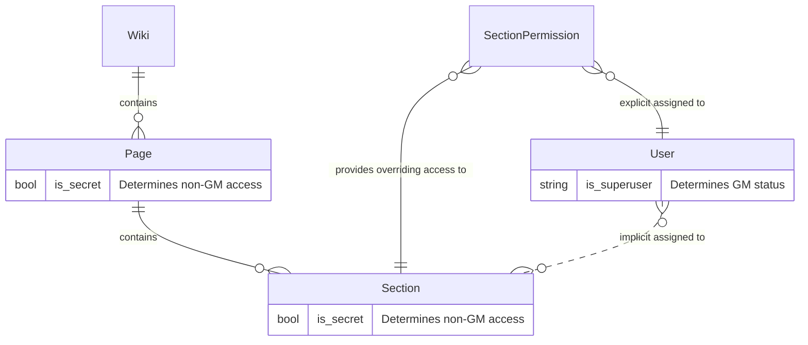

## The Data Model

## Future changes

* Changes table concept for auditing
* Enforce that no-one can create
* Page permissions granted per-user (same as section)
* Gamemaster(GM) access to all secrets bounded by some wiki permission
  * No permission means no universal secrets on that wiki
  * Multiple wikis hosted on same runtime-instance with different GM permissions
